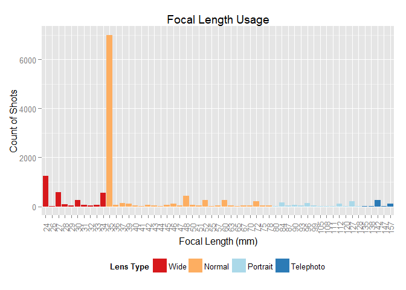
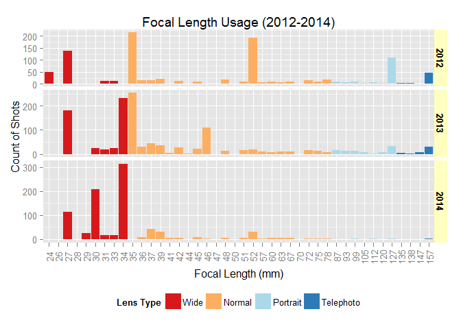

# Exploring Focal Length with Exiftool and R

A good way to understand your shooting style and guide your future camera equipment buying decisions will be to discover your frequently used focal lengths.  

Focal Lengths can be extract from photos that have EXIF data, which in short refers to data on how these photos are taken. You can find out more from an introductory article [here](http://photographylife.com/what-is-exif-data). In this post, we are going to explore focal length usage with the flexible Exiftool and R.  

Exiftool, which is built using Perl and is available on Windows, Mac OS X and Linux, is used for extracting required EXIF information of your photos. Meanwhile R, is used to perform exploratory data analysis and visualization. R is also available on Windows, MAC OS X and Linux.  

## Requirements

You will need to have the following installed:  
1. [Exiftool](http://www.sno.phy.queensu.ca/~phil/exiftool/) by Phil Harvey.  
2. [R](http://www.r-project.org/) Environment.  
3. Various additional R packages, which will be described in the code.  
4. (Optional) For development, editing and testing, you may want to use [Rstudio](http://www.rstudio.com/products/rstudio/download/), which is a free and open source IDE.

## Extracting and reading EXIF data

We shall invoke Exiftool from R using the `system2` command. Exiftool is capable of extracting a wide range of metadata from photos. We shall only extract common EXIF information and some additional EXIF tags for our purpose as well as  to demonstrate the tool’s usage. For further details, please visit the [documentation](http://www.sno.phy.queensu.ca/~phil/exiftool/exiftool_pod.html).  

We will be stating the focal length in terms of 35mm film format (or ‘full frame’ format) enabling us to view our usage across several camera devices (for example smartphones, DSLRs, Mirrorless Cameras, Point-and-Shoot, etc) - which is very common nowadays - with a standard benchmark.  

The extracted information will be saved in a tabluar format to a CSV file named “photodata.csv" to facilitate reading into R.  

Please remember to replace the file path below `d:/docs/photos` accordingly based on your system OS and location of the photos. Please note that the code below performs a recursive search (switch `-r`) in subdirectories.  


```r
## Replace the file path below accordingly
## Exiftool is assumed to be accessible from configured the system path
system2("exiftool", args="-common -ScaleFactor35efl -FocalLengthIn35mmFormat -FNumber -DateTimeOriginal -FileType -csv -t -r d:/docs/photos",stdout="photodata.csv")
```

Data is then read into R.  


```r
data <- read.csv("photodata.csv")
```

## Data Processing

### Exploring data
After checking that the required EXIF fields are extracted properly with the `names` command, we proceed to explore the nature of our data. It seems that there are invalid (NA) values that warrants further exploration. For my case, I also have multiple file types that needed filtering.


```r
library(dplyr)
data <- tbl_df(data) # change to local data frame for nice printing
names(data)
```

```
##  [1] "SourceFile"              "FileName"               
##  [3] "FileSize"                "Model"                  
##  [5] "DateTimeOriginal"        "ImageSize"              
##  [7] "Quality"                 "FocalLength"            
##  [9] "ShutterSpeed"            "Aperture"               
## [11] "ISO"                     "WhiteBalance"           
## [13] "Flash"                   "ScaleFactor35efl"       
## [15] "FocalLengthIn35mmFormat" "FNumber"                
## [17] "FileType"
```

```r
table(complete.cases(data))
```

```
## 
## FALSE  TRUE 
##   975 13963
```

```r
unique(data$FileType)
```

```
##  [1] 3GP  JPEG MP4  RAR  ZIP  FLV  WMV  MKV  M4V  PNG  MOV 
## Levels: 3GP FLV JPEG M4V MKV MOV MP4 PNG RAR WMV ZIP
```

### Cleaning data

From initial data exploration, cleaning of data is deemed necessary. Please note that your situation might differ significantly in this area.  

In addition to file type, I also have alot of camera models in my data. Filtering to commonly used cameras is needed.  


```r
## filter data
dataFocal <- data %>%
            filter(FileType=="JPEG", Model %in% c(
"Canon PowerShot A540","iPhone 4S","iPhone 5s","DMC-LX5","NIKON D7000","X100S") ) %>%
            select(FocalLength,ScaleFactor35efl,FocalLengthIn35mmFormat,DateTimeOriginal)
```

Also, not all cameras populate the `FocalLengthIn35mmFormat` tag, so we have to manually compute using the 35mm equivalent focal length variables. A new variable `FocalLengthUsed` is created: If a record has `FocalLengthIn35mmFormat` available, we shall use the value, otherwise `FocalLength * ScaleFactor35efl` is calculated and used.  

__Please note:__ As per the [Exiftool documentation](http://www.sno.phy.queensu.ca/~phil/exiftool/TagNames/Composite.html), any resized images will lead to inaccurate values being reported in `ScaleFactor35efl`, thus `FocalLengthUsed` might have inaccuracies included.  


```r
## clean data
library(lubridate)
library(stringr)

# convert timestamp to R Date format and set proper timezone
dataFocal$DateTimeOriginal <- dataFocal$DateTimeOriginal %>% 
                                ymd_hms() %>%
                                force_tz(., tzone="Singapore")

dataFocal <- dataFocal %>%
                mutate(FocalLength = as.character(FocalLength),
                       ScaleFactor35efl = as.character(ScaleFactor35efl),
                       FocalLengthIn35mmFormat = as.character(FocalLengthIn35mmFormat))

# remove "mm" string and trim whitespaces
dataFocal <- dataFocal %>%
                mutate(FocalLength = str_trim(str_replace(FocalLength,"mm","")),
                       ScaleFactor35efl = str_trim(str_replace(ScaleFactor35efl,"mm","")),
                       FocalLengthIn35mmFormat = str_trim(str_replace(FocalLengthIn35mmFormat,"mm","")))

dataFocal <- dataFocal %>%
                mutate(FocalLength = as.numeric(FocalLength),
                       ScaleFactor35efl = as.numeric(ScaleFactor35efl),
                       FocalLengthIn35mmFormat = as.numeric(FocalLengthIn35mmFormat))

# Derive new variable FocalLengthUsed
dataFocal <- dataFocal %>%
                mutate(FocalLengthUsed=ifelse(is.na(FocalLengthIn35mmFormat),round(FocalLength*ScaleFactor35efl),FocalLengthIn35mmFormat))
```
  
## Visualizing focal length usage

Let's create a bar chart to view our focal length usage. Let us also group the focal lengths into common lens types (by focal length) that you see in photography articles and books.  

As there is a lack of a standard category of lens types by focal length, we shall use the definition introduced by this [article](http://cameras.about.com/od/advanceddigitalcameras/tp/types-of-camera-lenses.htm).  

| Lens Type  | Focal Length Range (mm) |
|------------|-------------------------|
| Wide Angle | 0 to 34                 |
| Normal     | 35 to 79                |
| Portrait   | 80 to 134               |
| Telephoto  | 135 and above           |


```r
library(Hmisc)
# Set Lens Type definition and derive range in data
# Wide: 0 to 34 mm
# normal: 35 to 79 mm
# portrait: 80 to 134 mm
# telephoto: 135 mm and above
lensType=cut2(dataFocal$FocalLengthUsed,c(35,80,135))
levels(lensType) <- c("Wide","Normal","Portrait","Telephoto")

library(ggplot2)

# plot bar chart
ggplot(dataFocal,aes(factor(FocalLengthUsed),fill=lensType)) +
    geom_bar() +
    stat_bin(binwidth=1) +
    scale_x_discrete(breaks=seq(round(min(dataFocal$FocalLengthUsed),digits=-1), round(max(dataFocal$FocalLengthUsed),digits=-1), 1)) +
    theme(axis.text.x = element_text(angle = 90,
                                      hjust = 0.5, vjust = 0.5),
          legend.position="bottom") +
    labs(title="Focal Length Usage", x = "Focal Length (mm)", y = "Count of Shots", fill="Lens Type") +
    scale_fill_brewer(type = "div", palette = "RdYlBu")
```

 

From the bar chart above, it can be seen that I mostly shoot with normal angle lenses, with particular preference for the 35mm lens.  

Let us now look that the top 10 focal lengths I have used.  


```r
dataFocal %>%
    group_by(FocalLengthUsed) %>%
    summarise(FocalLengthUsed_count = n()) %>%
    top_n(10) %>%
    arrange(desc(FocalLengthUsed_count))
```

```
## Selecting by FocalLengthUsed_count
```

```
## Source: local data frame [10 x 2]
## 
##    FocalLengthUsed FocalLengthUsed_count
## 1               35                  7001
## 2               24                  1238
## 3               27                   585
## 4               34                   546
## 5               48                   421
## 6               30                   269
## 7               60                   254
## 8              142                   254
## 9               52                   249
## 10              72                   216
```

Like what the bar chart has shown, my top preference is the 35mm, followed by wide and normal lenses and finally portrait and telephoto lenses.  

We can also explore how our shooting habits change. Let's see how mine changed in the past 3 years.  


```r
## Derive new variable "Year" and filter years 2012 to 2014
dataFocalByYear <- dataFocal %>%
                mutate(Year=year(DateTimeOriginal)) %>%
                filter(Year>=2012)

# Set Lens Type definition and derive range in data
# Wide: 0 to 34 mm
# normal: 35 to 79 mm
# portrait: 80 to 134 mm
# telephoto: 135 mm and above
lensType=cut2(dataFocalByYear$FocalLengthUsed,c(35,80,135))
levels(lensType) <- c("Wide","Normal","Portrait","Telephoto")

# Plot bar chart by Year
ggplot(dataFocalByYear,aes(factor(FocalLengthUsed),fill=lensType)) +
    geom_bar() +
    stat_bin(binwidth=1) +
    facet_grid(Year~.,scales="free",space="free") +
    scale_x_discrete(breaks=seq(round(min(dataFocalByYear$FocalLengthUsed),digits=-1), round(max(dataFocalByYear$FocalLengthUsed),digits=-1), 1)) +
    theme(axis.text.x = element_text(angle = 90,
                                      hjust = 0.5, vjust = 0.5),
          strip.background = element_rect(fill="#ffffbf"),
          strip.text = element_text(face="bold"),
          legend.position="bottom") +
     labs(title="Focal Length Usage (2012-2014)", x = "Focal Length (mm)", y = "Count of Shots", fill="Lens Type") +
    scale_fill_brewer(type = "div", palette = "RdYlBu")
```

 

It can be seen that I have shot mostly with normal lenses and tried out wide, portrait and telephoto ranges in 2012. Over the 3 years, my style progressively shifted to shooting largely with wide and normal lenes.  

The 34mm result in 2014 is sort of surprising as it should be attributed to the 35mm lens that I have used consistently over the past 3 years. It could be due to the resizing of images as mentioned earlier, however it can only be determined by drilling down on that part of the data.  

It is worthy to point out again that we are using focal lengths with respect to the 35mm Format to standardize results. Therefore if you are shooting with a 35mm lens using a 1.5x crop sensor camera like Nikon D7000, you will get more counts on the 52mm focal length.  

## Conclusion

In this post, We have gone through extraction and cleaning of EXIF data,  visualizing frequently focal lengths used and finally, using the results to explore our shooting styles. Hope this is useful in your own exploration!

On an ending note, this is one example of discovering and exploring data sets in aspects of our everyday lives, allowing us to understand more of ourselves and act on them.
